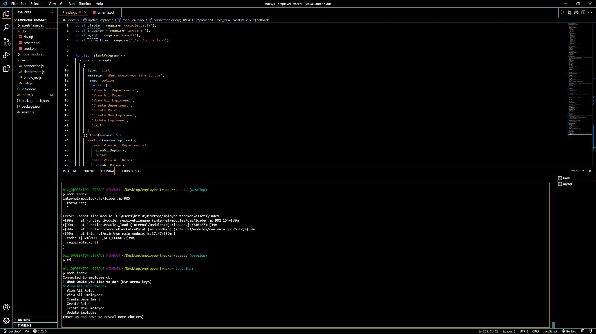

  # Employee Tracker

  ## **Description**
  A command-line application to manage a company's employee database, using Node.js, Inquirer, and MySQL.

  ## **Images**
  
  
  ## **Table of Contents**
  
  * [Installation](#dependencies)
  * [Usage](#usage)
  * [Credits](#credits)
  * [License](#license)
  * [Features](#features)
  * [Languages](#languages)
  * [Technology](#technology)
  * [Tests](#tests)
  * [Contribute](#contribute)
  
  ## **Installation**
  npm init -y, npm i inquirer, npm install console.table --save, npm install --save mysql2

  ## **Usage**
  Install all dependencies then go to the terminal and type 'node index'. Once inside the application, select from the options.

  ## **Credits**
  

  ## **License**
  
   
  
   

  ## **Features**
  https://drive.google.com/file/d/1HKFzBuIIUr1W-iiKPhsjpzgIspTQbaUf/view

  ## **Languages**
   Inquirer, Node JS

  ## **Technology**
  https://www.npmjs.com/package/console.table, https://www.npmjs.com/package/mysql2

  ## **Tests**
  There are no tests coded for this application

  ## **Contribute**
  Find me on [GitHub](https://www.github.com/mattbisbee)
   
  Send me an [Email](mailto:aldhelm7@gmail.com)
   
  [Contributor Covenant](https://www.contributor-covenant.org/)
